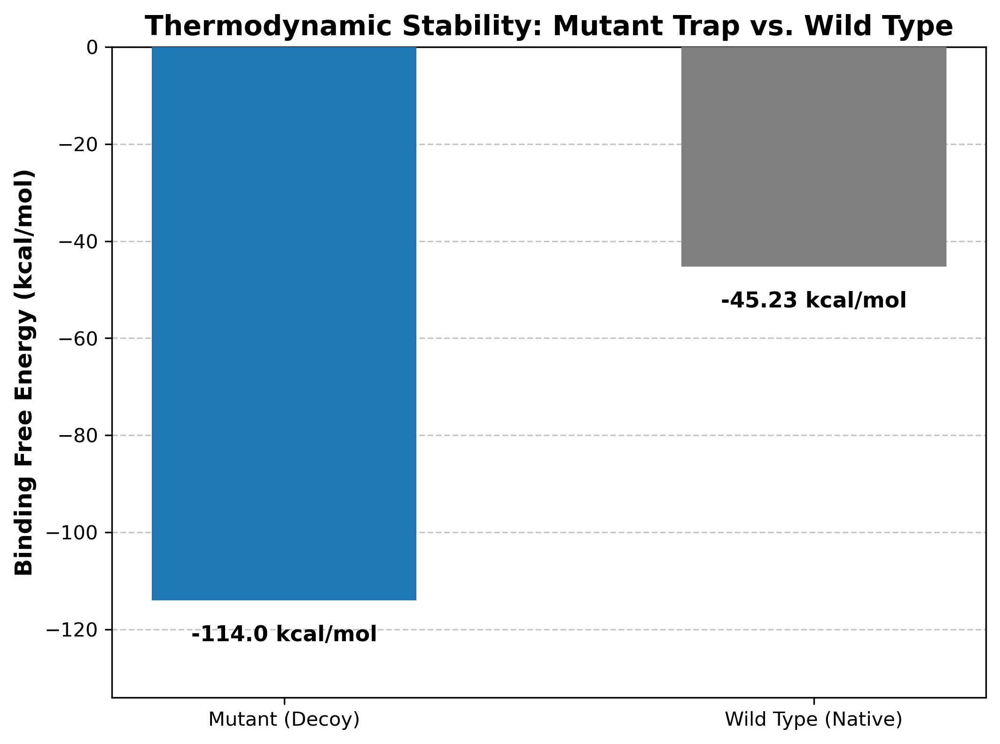
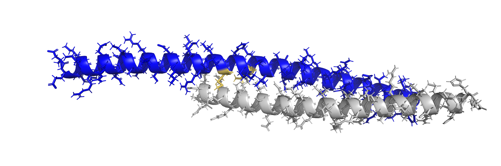
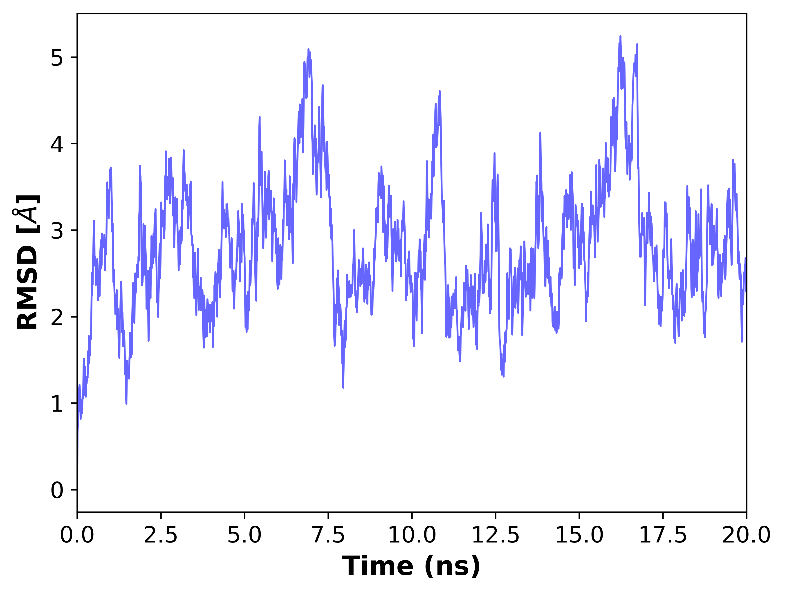

# PCOS_Therapeutic_Peptide
# 🧬 In Silico Design of a Dominant Negative Peptide for PCOS

### Project Overview
**Polycystic Ovary Syndrome (PCOS)** is characterized by ER stress in ovarian granulosa cells, leading to apoptosis via the **UPR pathway**. The key driver of this apoptosis is the transcription factor **DDIT3 (CHOP)**.

**Hypothesis:** By engineering a high-affinity "decoy" peptide based on the **C/EBP beta** leucine zipper, we can sequester CHOP, preventing it from translocating to the nucleus and triggering cell death.

---

### 🧪 Methodology
This project utilized a structural bioinformatics pipeline to design and validate the therapeutic peptide:

1.  **Target Identification:** Structural analysis of C/EBP beta and DDIT3 (CHOP) dimerization interface.
2.  **In Silico Saturation Mutagenesis:** Used **BioSig** to scan the mutational landscape.
    * *Optimization:* Filtered out mutations causing steric clashes, prioritizing electrostatic complementarity.
3.  **Molecular Docking:** Performed protein-peptide docking using **HawkDock** and **HADDOCK**.
4.  **Dynamic Simulation:** Verified complex stability using **OpenMM** (via the Making-it-Rain pipeline).
Parameters: **20ns production run**, AMBER forcefields, accelerated by NVIDIA Tesla T4 GPUs (Google Colab).
5.  **Physicochemical Profiling:** Assessed solubility (GRAVY) and evolutionary conservation (BLAST).

---

### 📊 Key Results

#### 1. Thermodynamic Stability (Mutant vs. Wild Type)
The engineered mutant demonstrates a significantly stronger binding affinity compared to the native C/EBP beta interaction, supporting the "Molecular Trap" hypothesis.

*(Figure 1: Comparison of Binding Free Energy. The mutant trap shows a >2-fold increase in affinity.)*

#### 2. Structural Validation
The mutant peptide targets the leucine zipper domain of CHOP wjile preserving the structural integrity of the hydrophobic interface.

*(Figure 2: PyMOL visualization of the Mutant Peptide [Blue] bound to DDIT3 [Gray]. Key mutations are highlighted in yellow.)*

#### 3. Simulation Stability & Dynamics
The 20ns MD trajectory reveals a dynamic but stable interaction. The RMSD fluctuates between 2Å and 5Å, displaying characteristic "elastic rebound" behavior common in short peptide chains. This indicates the peptide maintains binding while exhibiting conformational flexibility, rather than dissociating.

*(Figure 3: 20ns MD Simulation trajectory showing dynamic equilibrium.)*

#### 4. Physicochemical Properties
* **Evolutionary Conservation:** BLAST analysis confirms a **96.77% sequence identity** with human C/EBP beta, minimizing the risk of immunogenicity.
* **Solubility (GRAVY Score):** A score of **-1.455** indicates the peptide is highly hydrophilic, suggesting excellent solubility in aqueous cellular environments.

---

### 🔮 Future Directions
* **In Vitro Validation:** Competitive binding assays (EMSA) to confirm CHOP sequestration.
* **Delivery System:** Attaching Cell-Penetrating Peptides (CPPs) for intracellular delivery (essential due to hydrophilic GRAVY score).
* **Population Genetics:** Investigating the conservation of the target interface across diverse human populations.
